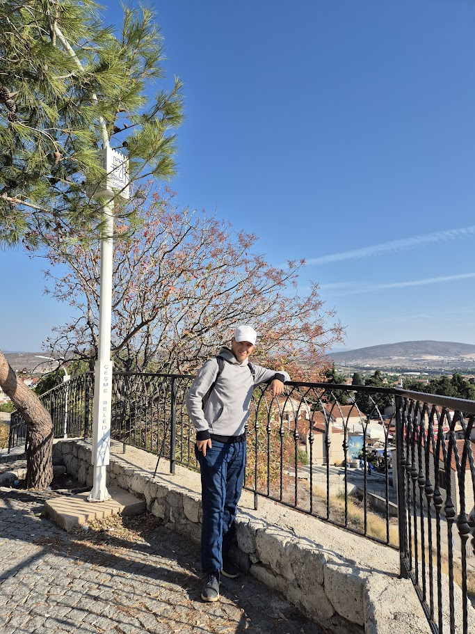

  

  <h1>Hi, I'm Aziz Demir</h1>
  <h3>Software • Industrial IoT • Automation • Legacy Modernization</h3>

  

    I build practical systems where software meets electronics, automation and real-world workflows.
     
    I like modern technologies, but I also care about older systems that still keep businesses running.
  

  

    <strong>Home - Work - Code - Sleep</strong>
     
    No Instagram. No Twitter. Yes Code.
  

---

<table>
  <tr>
    <td width="50%">
      <h3>⚙️ Engineering Focus</h3>
      

        Industrial IoT, embedded control, sensor data, automation panels, monitoring tools and hardware-software integration.
      

    </td>
    <td width="50%">
      <h3>💻 Software Focus</h3>
      

        Modern web tools, desktop utilities, offline-first systems, network tools and legacy workflow modernization.
      

    </td>
  </tr>
</table>

## 🚀 About Me

* 🔧 I work on connected systems that combine software, electronics and automation
* 🏭 I am interested in industrial IoT, remote monitoring and embedded control
* 🧠 I like turning old workflows into cleaner, faster and more usable software
* 🧩 I build practical tools instead of only good-looking demos
* 📈 I care about maintainable code, reliability and long-term usability

---

## 🧭 What I'm Exploring

<table>
  <tr>
    <td>🏭 Industrial IoT</td>
    <td>Remote monitoring, sensor data and connected devices</td>
  </tr>
  <tr>
    <td>🧠 Local AI</td>
    <td>Offline tools, local-first workflows and private AI usage</td>
  </tr>
  <tr>
    <td>🧰 Automation</td>
    <td>Scripts, desktop tools and workflow helpers</td>
  </tr>
  <tr>
    <td>🕰️ Legacy Systems</td>
    <td>Modernizing older software without ignoring what already works</td>
  </tr>
  <tr>
    <td>🌐 Network Tools</td>
    <td>VPN, proxy profiles and connection management utilities</td>
  </tr>
</table>

---

## 🛠️ Technologies and Tools

  
  
  
  
  
  
  
  
  

---

## 🧪 Featured Work

<table>
  <tr>
    <td width="50%">
      <h3>🌍 Sensor Monitoring</h3>
      

        Filtering, signal processing and event detection ideas for sensor-based monitoring systems.
      

    </td>
    <td width="50%">
      <h3>🔐 Network Utilities</h3>
      

        VPN and proxy profile management tools focused on practical desktop usage.
      

    </td>
  </tr>
  <tr>
    <td width="50%">
      <h3>🤖 Offline AI</h3>
      

        Windows-focused setup ideas for running AI tools locally and independently.
      

    </td>
    <td width="50%">
      <h3>🖥️ Desktop Control</h3>
      

        Windows utilities for controlled computer usage and simple system management.
      

    </td>
  </tr>
</table>

---

## 📊 GitHub Stats

  
  

---

  <h3>📫 Contact</h3>
  
You can explore my repositories and follow my work here on GitHub.

  
<strong>Last update:</strong> 2026

